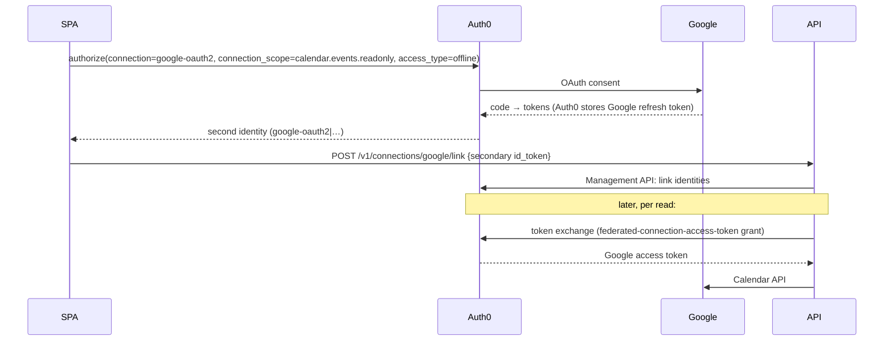
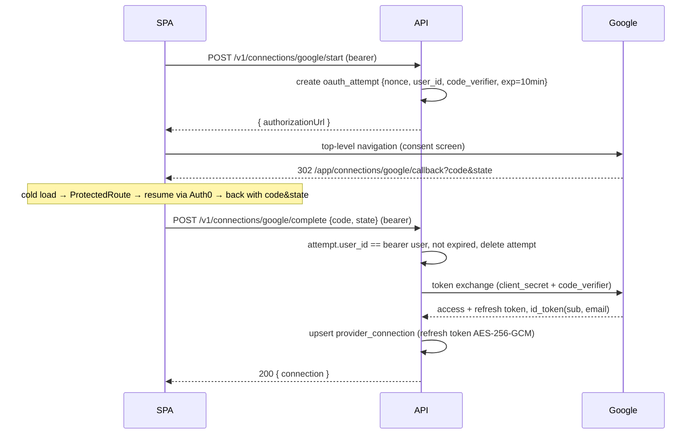

# Kingdom Keys — optional Google Calendar connection (design decision)

**Status:** draft for decision · **Date:** 2026-09-16 · **Owner:** Carol
**Feeds:** DESIGN.md decision Q13 (integration architecture) + Q14 (release versioning); Specs 16.0 / 16.1 / 17

---

## 1. Summary and goals

**Kingdom Keys** is a user-controlled key ring: a place in the Profile where a user can hand the
app a *revocable, read-only* key to an external account, and take it back at any time. Google
Calendar is the first key. Gmail, wearables (DESIGN.md §5.4) and other providers are later keys
on the same ring.

The one-line requirement, as clarified:

> A user can turn on a **Google connection** that lets the app **read their Google Calendar**.
> **Google is never the login.** Auth0 stays the only identity provider; if Google is down, or the
> user has no Google account, everything except calendar features keeps working.

### Success criteria

1. From Profile, a signed-in user can **connect** their Google account with a Calendar read-only
   grant, and see that it is connected (which Google account, when).
2. The app can **read the user's calendar events** for a date range through our own API.
3. The user can **disconnect**; the grant is revoked at Google and nothing usable remains in our DB.
4. **Account deletion** revokes the grant as part of the existing §4.9 flow.
5. The connection state has **no effect on login**: no Auth0 identity is created, linked, or
   required; the feature can be fully switched off per environment by leaving its config unset.
6. Shipping this chain is the project's **first versioned release** (`0.1.0`, §7 below).

## 2. Non-goals

- **Gmail** read. Gmail scopes are Google *restricted* scopes, which require a CASA security
  assessment before verification — a cost and timeline decision on its own. The key-ring design
  below is built so Gmail is "another scope on the same connection", but nothing here requests it.
- **Google as a login** (or as an *alternative* login for an existing account).
- **Offline / PWA** — unchanged; DESIGN.md §5.3 / R1 / M4.
- **Writing** to Google Calendar (creating workout events). Read-only only.
- **Persisting** calendar data in our DB. v1 is pass-through; caching is an open question (§9).
- Google Workspace "internal" app publishing (that only helps if every user is in one Workspace).

## 3. Constraints inherited from DESIGN.md

| Constraint | Source | Consequence for this feature |
|---|---|---|
| The API is the only contract; nothing browser-specific | §3.4 rule 1 | Connect / read / disconnect must be API endpoints a native app can call unchanged |
| Auth is standard OIDC; nothing web-specific in token handling | §3.4 rule 3 | A Google connection must not change how the API validates identity |
| Schema extension over schema change; expand-only migrations | §3.4 rule 5, §7 | New tables, no changes to `user`; migrations run as a release step |
| Auth0 was chosen *because* it is standards-based and replaceable | Q2, R3 | Prefer designs that survive an Auth0 → other-IdP move |
| Browser holds tokens in memory only | Q12 | The SPA must never persist a Google token |
| Strict CSP (`script-src 'self'`, exact `connect-src`), owned by Spec 04.0 | §8.2 | Any browser-side Google SDK or direct browser→Google API call is a CSP change |
| API config is fail-fast on every declared var | `apps/api/src/config.ts` | Google vars must be optional so the API boots without them |
| Everything under `/v1` runs the bearer guard (and needs an `email` claim) | `apps/api/src/plugins/auth.ts` | An unauthenticated OAuth callback cannot live under `/v1` |
| Every route declares a Zod response schema; DTOs live in `packages/core` | Spec 03.0 | New DTOs go in `packages/core/src/dto/`, OpenAPI drift check applies |
| Deletion matrix | §4.9 | New table needs a row in the matrix |

Verified facts that shape the options (sources at the end):

- `calendar.events.readonly` / `calendar.readonly` are Google **sensitive** scopes: verification
  needs a consent-screen review, a scope justification and a demo video. **No CASA.** Gmail read
  scopes are **restricted** and do need CASA.
- While the OAuth consent screen is in **Testing** status, refresh tokens **expire after 7 days**
  and the app is capped at 100 test users. Durable connections require publishing the consent
  screen "In production" (and, for sensitive scopes, passing verification).
- Auth0 **Token Vault** (federated-connection token exchange) is **Early Access** under free-trial
  terms; availability and pricing on the free plan are not published.

## 4. Options

### Option A — Auth0-brokered: account linking + Token Vault

**What we build:** a "link" endpoint that calls the Management API, a Token Vault exchange helper,
the calendar read endpoint, and the UI. **What we don't build:** any token storage or encryption.

**Pros**
- No Google refresh tokens in our database, so no crypto, no key rotation, no `invalid_grant`
  bookkeeping — Auth0 refreshes on our behalf.
- Least backend code of the persistent options.

**Cons**
- **Token Vault is Early Access** under free-trial terms. Whether it exists on the plan we run,
  and what it will cost, is unknown. That is a blocking risk for a hobby-scale project.
- **Linking makes Google a valid login for the primary account.** Once identities are linked,
  "Continue with Google" on the Auth0 login page signs the user straight into the same account.
  That is precisely what the requirement excludes; disabling it means fighting Auth0's model.
- Account linking is a known foot-gun: email collisions, choosing the primary identity, and the
  Management API needing an M2M client with `update:users` scope in the API.
- **Locks the feature to Auth0**, against the vendor-neutral posture Q2 / R3 paid for. A future
  IdP move would rebuild the whole feature, not just login.
- We still need our own Google Cloud client and verification (Auth0 dev keys are not allowed in
  production), so the Google-side work is identical to Option B.

### Option B — API-owned Google OAuth + encrypted key ring in our Postgres  *(recommended)*

The API is a **confidential** Google OAuth client. The browser only ever carries an
authorization code and an opaque `state`; all tokens live server-side, encrypted.

**Flow notes**
- The redirect URI is a **protected SPA route** (`/app/connections/google/callback`). Because
  the SPA holds tokens in memory (Q12), the redirect back is a cold load; the existing
  `ProtectedRoute → PublicEntry` resume bridge already carries `pathname + search` in
  `returnTo`, so `code` and `state` survive the Auth0 round-trip with no `sessionStorage`. This
  mirrors the existing `/callback` pattern and costs one extra redirect, which Q12 already
  accepts as a known cost.
- `state` is a random nonce that keys a server-side `oauth_attempt` row (user id, PKCE verifier,
  10-minute expiry). The `complete` endpoint requires the bearer user to match the attempt's
  user — that is the CSRF binding. No HMAC key needed.
- Reads: `GET /v1/calendar/events?from&to` — the API mints a short-lived access token from the
  stored refresh token (cached in process until expiry), calls Google Calendar, and returns a
  normalized `@sin/core` DTO. Nothing is persisted.
- `DELETE /v1/connections/google` revokes at Google's revoke endpoint, then deletes the row.
  A Google `invalid_grant` on refresh flips `status` to `revoked`, and the UI offers "Reconnect".
- Feature is off per environment when the Google config is unset: the connection endpoints
  return a `503 feature-unavailable` problem and the UI hides the section (a capabilities flag on
  `GET /v1/me` or a `GET /v1/connections` listing, decided in the spec).

**Pros**
- Strictly satisfies "Google is not the login": no Auth0 identity is ever created or linked.
- Vendor-neutral; survives an IdP move untouched.
- API-only contract (§3.4 rule 1): a native app registers its own redirect URI and calls the same
  `start` / `complete` endpoints.
- Matches the §5.4 "read-only per-provider connector" pattern; the same `provider_connection`
  table serves wearables later (`provider = 'garmin'`, …).
- Browser never holds a Google token (Q12 intact) and **no CSP change** — a top-level navigation
  is not governed by CSP, and the API↔Google calls are server-side.
- Every API route stays behind the bearer guard; no unauthenticated callback surface.

**Cons**
- The most code: an OAuth client, an encryption helper with key rotation, refresh-token
  lifecycle, a Google API caller, two tables.
- Three new API secrets (`GOOGLE_OAUTH_CLIENT_ID`, `GOOGLE_OAUTH_CLIENT_SECRET`,
  `CONNECTION_TOKEN_KEY`) — set per environment in Render; all optional.
- We hold user refresh tokens, so our threat model widens: a DB leak plus the key is a
  Calendar-read leak. Mitigated by envelope encryption with the key outside the DB, least
  privilege (read-only scope), and revoke-on-delete.
- We own Google verification and the "In production" consent-screen publish, including a
  hosted privacy policy on a domain we control (see §8 — a real dependency).

**Rejected variant:** API-side callback (`GET /connections/google/callback` outside `/v1`). It
would need an unauthenticated route, a signed state to recover the user, and a server→SPA
redirect to `WEB_ORIGIN`; and a native app would need a different callback path. The SPA-route
callback avoids all three.

### Option C — Browser-only grant (Google Identity Services token client)

The SPA loads Google's GIS library, requests a one-hour Calendar access token into memory, and
calls the Calendar API directly from the browser. The API never sees Google.

**Pros**
- Least code; zero secrets stored anywhere; zero Google data or tokens on our servers, so the
  simplest privacy disclosure.

**Cons**
- **Breaks the strict CSP** that Spec 04.0 owns: needs `script-src https://accounts.google.com`,
  `connect-src https://www.googleapis.com`, `frame-src https://accounts.google.com`. CSP is the
  primary XSS control for a memory-token SPA (§8.2); loosening `script-src` is a real cost.
- **No refresh token in the browser.** The user re-grants every session; silent renewal depends
  on Google's cookie session and is fragile under third-party-cookie blocking and popup blocking
  on mobile Safari — the app's primary surface.
- It is not a persistent "turn on" feature, which is what was asked; it is a per-session grant.
- No server-side use ever (no reminders, no background import), and no native-app parity
  (§3.4 rule 1 is violated: the feature exists only in the web client).

### Comparison

| | A · Auth0 Token Vault | **B · API-owned key ring** | C · Browser-only |
|---|---|---|---|
| "Google is not the login" | ✗ linking makes Google a login | **✓** | ✓ |
| Persistent connection | ✓ | **✓** | ✗ per session |
| Vendor-neutral (Q2 / R3) | ✗ | **✓** | ✓ |
| Native-app parity (§3.4.1) | ✓ | **✓** | ✗ |
| CSP unchanged | ✓ | **✓** | ✗ |
| Secrets we store | none | refresh tokens (encrypted) | none |
| Backend code | small | **largest** | none |
| Blocking external risk | Token Vault EA / pricing | Google verification | Google verification |
| Reusable for wearables §5.4 | partly (Auth0-supported IdPs only) | **✓** | ✗ |

## 5. Recommendation

**Option B.** It is the only option that satisfies the requirement strictly, keeps the
vendor-neutral posture already chosen in Q2, and yields a key ring that §5.4 wearable connectors
and a future Gmail scope reuse. Its extra cost is well-bounded backend code plus the Google
verification work that Options A and C need anyway.

Revisit Option A only if Token Vault reaches GA on a plan we can use *and* Auth0 lock-in becomes
acceptable. Option C is a reasonable **spike** to try the Calendar API for a day, but not the
shipped design.

## 6. Sketch of the recommended design

Everything below is an outline for Spec 16.0 / 16.1 / 17 to firm up in the 12-section template.

### 6.1 Data model (two new tables, expand-only)

**`provider_connection`** — one active key per `(user_id, provider)`.

| Column | Type | Notes |
|---|---|---|
| `id` | uuid (v7) | |
| `user_id` | uuid → `user.id` | `ON DELETE CASCADE` |
| `provider` | text | CHECK `IN ('google')` — grows with §5.4 |
| `provider_sub` | text | Google `sub` from the id_token; stable account identifier |
| `provider_email` | text | for display only ("Connected as …"); may drift |
| `scopes` | text[] | scopes actually granted (Google can grant a subset) |
| `refresh_token_ciphertext` | bytea | AES-256-GCM |
| `refresh_token_key_id` | text | which `CONNECTION_TOKEN_KEY` encrypted it |
| `status` | text | CHECK `IN ('active','revoked')` |
| `last_used_at`, `revoked_at` | timestamptz | |
| `created_at`, `updated_at` | timestamptz | per §4.0 |

Unique `(user_id, provider)`. No calendar data is stored.

**`oauth_attempt`** — short-lived PKCE/state rows.

| Column | Notes |
|---|---|
| `nonce` (PK) | 32 random bytes, base64url; this is the OAuth `state` |
| `user_id` | bound at `start`, checked at `complete` |
| `provider` | |
| `code_verifier` | PKCE verifier |
| `expires_at` | `now() + 10 min`; rows deleted on completion, swept opportunistically |

**Deletion matrix (§4.9) rows to add**

| Entity | On user action | On account deletion |
|---|---|---|
| `provider_connection` | disconnect: revoke at provider, hard delete | revoke at provider during soft-delete; hard purge by cascade |
| `oauth_attempt` | expires in 10 min | cascade |

### 6.2 API surface (all under `/v1`, bearer-guarded, Zod response schemas)

| Method & path | Purpose |
|---|---|
| `GET /v1/connections` | list connection summaries per provider (`status`, `providerEmail`, `scopes`, `connectedAt`) and whether each provider is enabled in this environment |
| `POST /v1/connections/google/start` | creates `oauth_attempt`, returns `{ authorizationUrl }` (`access_type=offline`, `prompt=consent`, `include_granted_scopes=true`, PKCE S256) |
| `POST /v1/connections/google/complete` | body `{ code, state }`; validates attempt ↔ bearer user; exchanges; upserts connection; returns the summary |
| `DELETE /v1/connections/google` | revoke at Google, delete row; `204` |
| `GET /v1/calendar/events?from&to` | requires an active Google connection; returns normalized events (`id`, `title`, `start`, `end`, `allDay`, `calendarId`); `409 connection-required` / `409 connection-revoked` problem types when absent or revoked |

DTOs in `packages/core/src/dto/connections.ts` and `calendar.ts` (pattern: `me.ts`); OpenAPI
regenerated and drift-checked (Spec 03.0).

### 6.3 Security and privacy

- **Scope:** `https://www.googleapis.com/auth/calendar.events.readonly` only (plus
  `calendar.calendarlist.readonly` if listing calendars is needed — decide in Spec 17). Both are
  *sensitive*, not *restricted*.
- **Encryption at rest:** AES-256-GCM via Node `crypto`, 32-byte key from
  `CONNECTION_TOKEN_KEY` (`<key_id>:<base64>`), random 96-bit IV per row, AAD = `user_id` +
  `provider` so a ciphertext cannot be moved between rows. Rotation: optional
  `CONNECTION_TOKEN_KEY_PREVIOUS`; rows are re-encrypted on next use.
- **CSRF / mix-up:** `state` nonce is single-use, expires in 10 minutes, and must belong to the
  bearer user calling `complete`. PKCE S256 on top, per Google's recommendation for all clients.
- **Never in logs:** codes, tokens, `authorizationUrl` (it contains no secrets but is noisy),
  Google error bodies beyond `error` / `error_description`. Extend the pino redact list.
- **Minimum retention:** refresh token only; access tokens in process memory until expiry.
- **Revocation on every exit:** disconnect, account deletion, and `invalid_grant`.
- **Privacy disclosure:** the privacy policy must state what Calendar data is read and that it is
  not stored — Google verification checks this.

### 6.4 Config (API — all optional; feature off when any is missing)

| Var | Where |
|---|---|
| `GOOGLE_OAUTH_CLIENT_ID` | Render env group `api-shared` (not secret) |
| `GOOGLE_OAUTH_CLIENT_SECRET` | Render dashboard, `sync: false` |
| `GOOGLE_OAUTH_REDIRECT_URI` | per environment, e.g. `https://<web-origin>/app/connections/google/callback` |
| `CONNECTION_TOKEN_KEY` | Render dashboard, `sync: false`; format `<key_id>:<base64>`, e.g. `k1:$(openssl rand -base64 32)` |

`loadConfig` exposes `config.google?: { clientId, clientSecret, redirectUri }` and
`config.connectionTokenKey?`; both must be present together or the feature is disabled and the
API logs one boot-time `info` line saying so. No web (`VITE_`) vars are needed.

### 6.5 Web (Spec 16.1)

- New route `/app/connections/google/callback` (protected) that reads `code` / `state`, calls
  `complete`, then navigates to `/app/profile` with a success/failure notice.
- Profile screen gains a **Connected accounts** section: "Connect Google Calendar" (a `Button`,
  navigates to `authorizationUrl`), or "Connected as name@gmail.com · Disconnect", or
  "Connection expired · Reconnect". No new toggle primitive is required.
- `useConnections` / `useDisconnect` hooks on TanStack Query, mirroring `useMe` / `useUpdateMe`.
- Version footer on the Profile screen (§7).

### 6.6 Observability

- Log events: `connection.started`, `connection.completed`, `connection.revoked`
  (`provider`, `reason`), `calendar.read` (`durationMs`, `eventCount`) — never token material.
- Counters: connections active per provider; Google API error rate by status.

### 6.7 Google Cloud setup and verification (release steps for the runbook)

1. Create a Google Cloud project; enable the **Google Calendar API**.
2. OAuth consent screen: External; app name, support email, **homepage and privacy-policy URLs
   on a domain we own** (see open question §9.1); authorized domain.
3. Create an OAuth client (**Web application**) with the per-environment redirect URIs.
4. Staging runs in **Testing** status with the developer's account as a test user — accept that
   refresh tokens expire after 7 days there.
5. Before production: record the demo video, submit for **sensitive-scope verification**, then
   publish **In production**.

### 6.8 Decomposition into specs (API-first, one session each)

| Spec | Scope |
|---|---|
| **16.0 Google connection (API)** | tables, migration, config, encryption helper, `start` / `complete` / `DELETE`, `GET /v1/connections`, revoke-on-delete hook |
| **16.1 Connected accounts (UI)** | callback route, Profile section, hooks, version footer, changelog + `0.1.0` bump |
| **17 Calendar read (API + UI)** | `GET /v1/calendar/events`, Google client with refresh/cache, first consumer screen (decide in Spec 06/08 where events appear) |

Roadmap placement: after M1 (Spec 06) unless the calendar view is wanted earlier; 16.0 has no
dependency on workout logging and could be pulled forward.

## 7. Release versioning (in scope, independent of the option chosen)

Today every `package.json` is `0.0.0`, there are no git tags and no changelog; the API is versioned
only by the `/v1` path. DESIGN.md §7 already says "git tag → promote to production", so a tag
convention is the missing half. Proportional, solo-developer rules:

- **One product version.** The root `package.json` `version` is the source of truth; the three
  workspace packages are bumped in lockstep (they are never published to npm).
- **Semver, pre-1.0:** minor bump when a feature-spec chain ships, patch for fixes and doc-only
  releases that touch deployed behavior. `1.0.0` = GA (Spec 14).
- **Kingdom Keys ships as `0.1.0`.** M0 remains `0.0.0` retroactively — nothing to relabel.
- **`CHANGELOG.md`** at the repo root in Keep-a-Changelog format; each feature PR adds its entry
  under *Unreleased*, and the release PR moves it under the version heading.
- **Tag `vX.Y.Z`** (annotated) on `main` after the release PR merges. Manual `git tag` + `push
  --tags`, documented in `docs/runbooks/first-deploy.md`. A CI release job is not needed for v1.
- **Surface the version:** `GET /healthz` returns `{ status, version }` (read from
  `package.json` at build); the web app exposes `__APP_VERSION__` through a Vite `define` and
  shows it in the Profile screen footer. Sentry releases (Spec 13) reuse the same string.
- **Where the bump lands:** in the last PR of the chain (Spec 16.1), together with the changelog
  entry, so `main` is always tagged at a shippable point.
- **Not `/v2`.** DESIGN.md Q3 reserves path bumps for breaking API changes; these endpoints are
  additive.

Recorded in DESIGN.md as decision **Q14** with a new "Release versioning" row in §7.

## 8. Dependencies and risks

| Risk | Impact | Mitigation |
|---|---|---|
| Google verification requires a hosted privacy policy on an owned domain | blocks "In production" | a static privacy page on the web origin is enough for verification; the marketing site (Spec 14) is not a prerequisite |
| Testing-status refresh tokens expire in 7 days | staging connections silently die | `invalid_grant` → `revoked` + "Reconnect" UI handles it; documented in the runbook |
| Verification review time (weeks) | delays production | submit as soon as 16.0 is deployable; staging works meanwhile |
| Encryption key loss | all connections unusable | key lives in Render dashboard; document backup in the runbook; failure mode is "reconnect", not data loss |
| Render free cold starts + Google latency | slow first calendar read | acceptable for v1; same caveat as every endpoint |

## 9. Open questions

1. **Privacy-policy hosting.** Where does the policy page live before Spec 14 — a static route on
   the SPA origin, or a bare page on the future custom domain?
2. **Which calendars?** Primary only (no `calendarlist` scope) or all calendars the user has
   selected in Google? Primary-only is the least-privilege default.
3. **Where do events appear first?** Today's calendar on the Workouts screen (Spec 06), or a
   week view in History (Spec 08)? This decides Spec 17's UI half.
4. **Caching.** Pass-through in v1; do we want a 60-second in-process cache per user to soften
   Google rate limits and cold starts?
5. **Roadmap slot.** After M1 as proposed, or pull 16.0 forward as the next spec after 03.2?

## Sources

- Google — Sensitive scope verification (Calendar read is a sensitive scope; verification with demo video, no CASA): https://developers.google.com/identity/protocols/oauth2/production-readiness/sensitive-scope-verification
- Google — Restricted scope verification (Gmail scopes; CASA required): https://developers.google.com/identity/protocols/oauth2/production-readiness/restricted-scope-verification
- Google — Manage app audience (Testing status: 100 test users, 7-day refresh-token expiry): https://support.google.com/cloud/answer/15549945
- Auth0 — Token Vault docs (Early Access, free-trial terms): https://auth0.com/docs/secure/tokens/token-vault
- Auth0 — Access token exchange with Token Vault: https://dev.auth0.com/docs/secure/tokens/token-vault/access-token-exchange-with-token-vault
